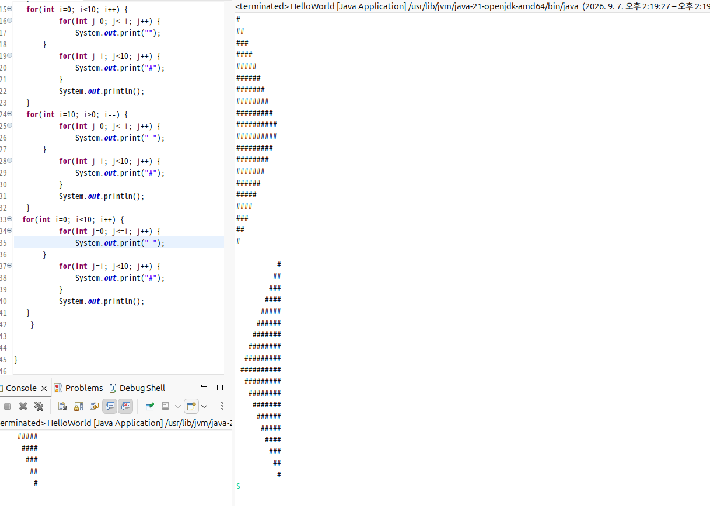
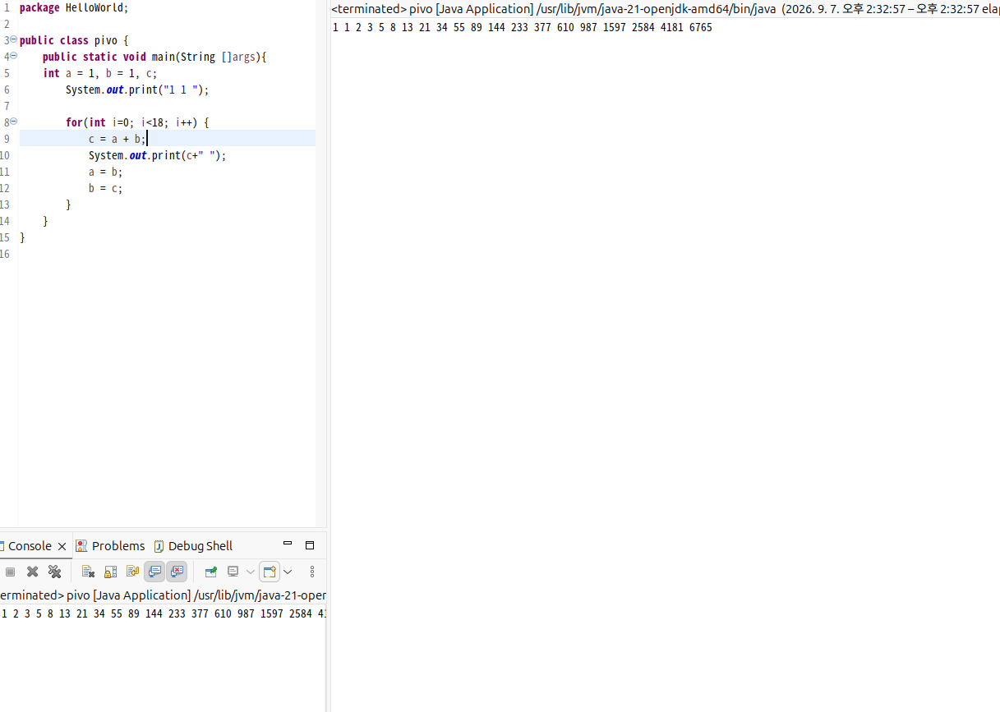
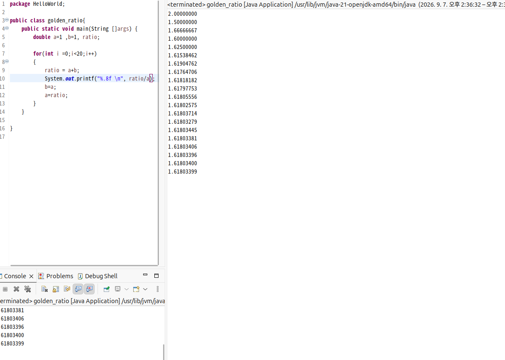
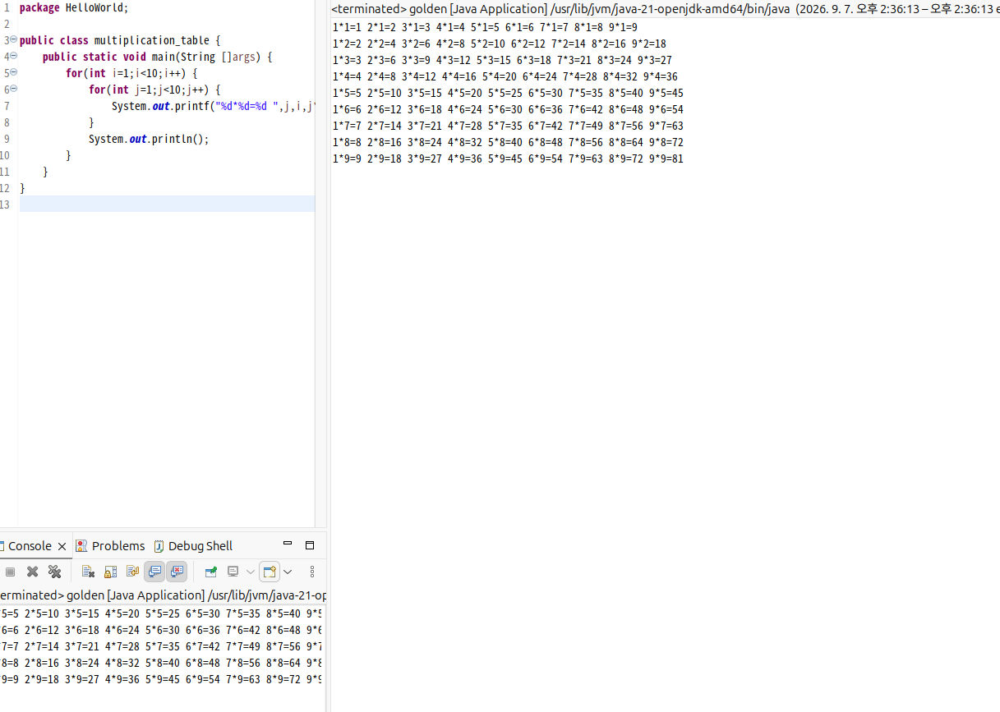
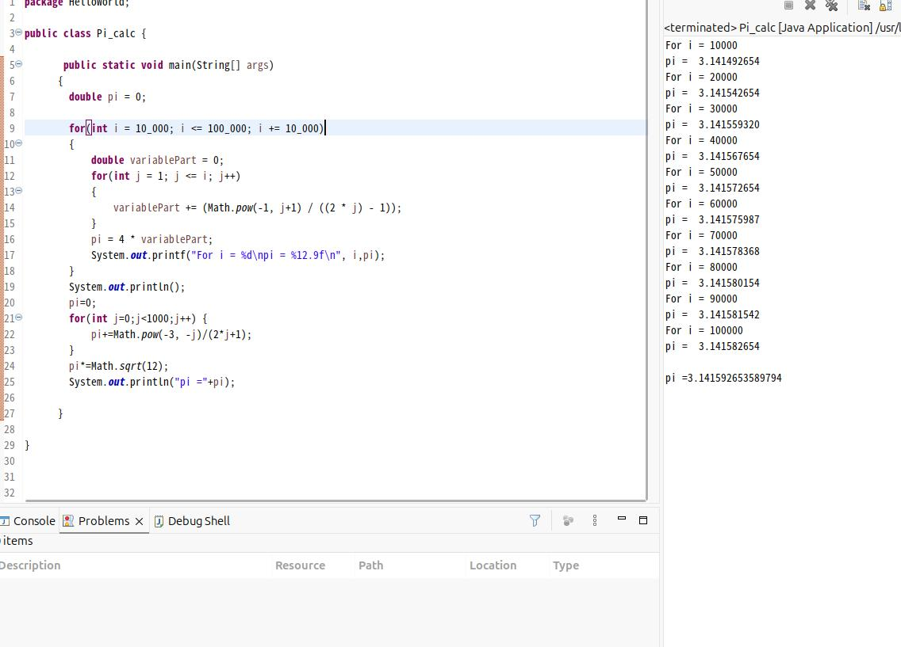
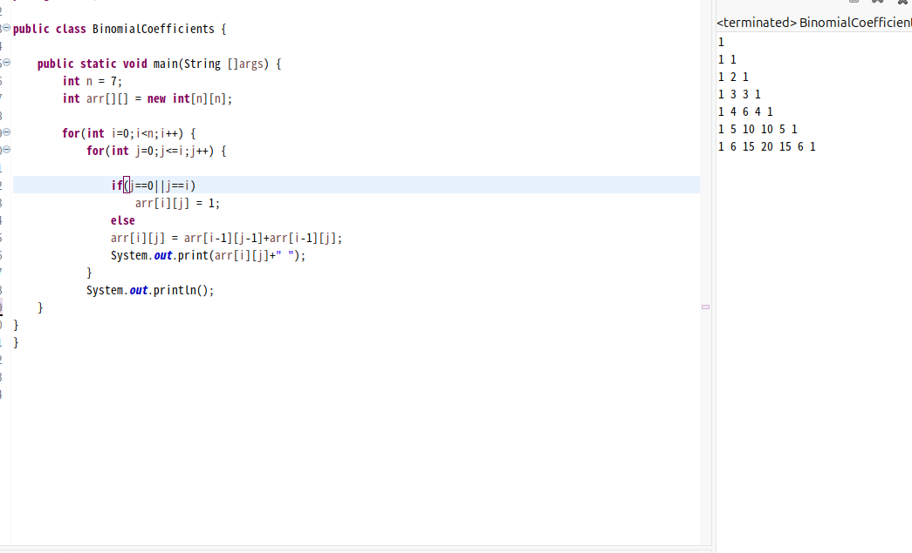
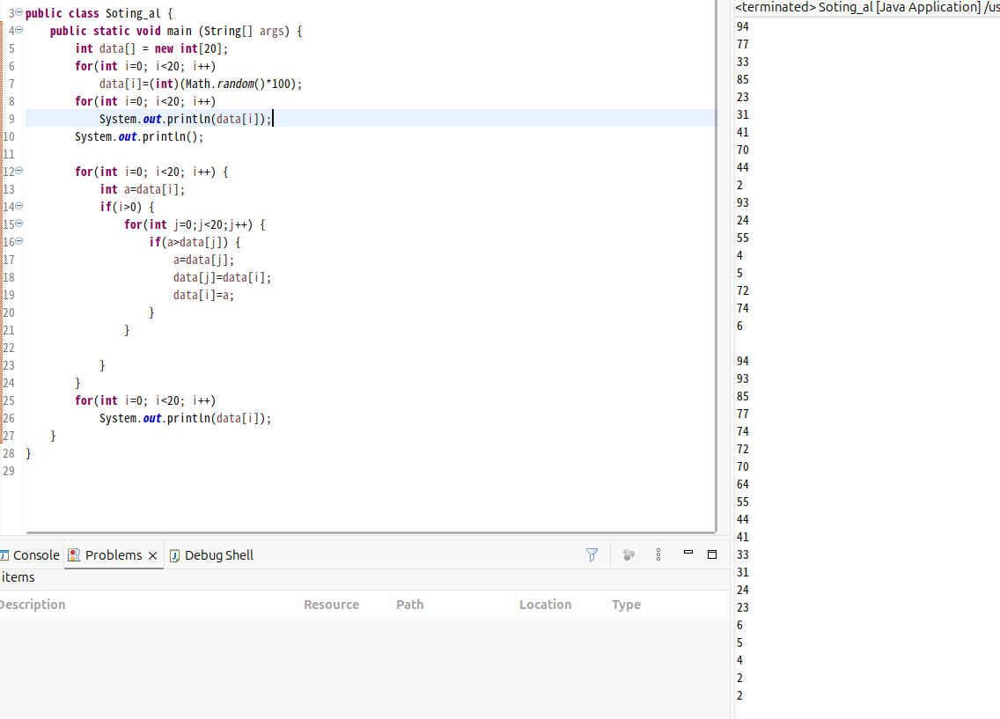
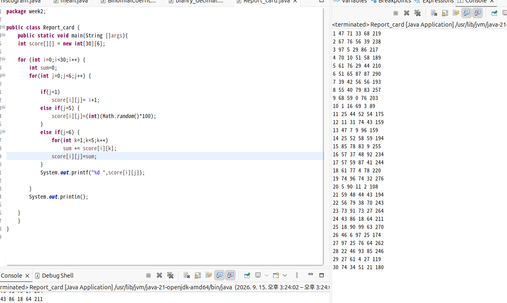

# OOP2026


## week1
<details>
	<summary></summary>
<details>
	<summary>
		### Homework 1
		</summary>
	

```java

public class HelloWorld {
    public static void main(String []args){
       for(int i=0; i<10; i++) {
           for(int j=0; j<=i; j++) {
               System.out.print("#");
       }
           for(int j=i; j<10; j++) {
               System.out.print(" ");
           }
          
           System.out.println();
   }
   for(int i=0; i<10; i++) {
           for(int j=0; j<=i; j++) {
               System.out.print("");
       }
           for(int j=i; j<10; j++) {
               System.out.print("#");
           }
           System.out.println();
   }
   for(int i=10; i>0; i--) {
           for(int j=0; j<=i; j++) {
               System.out.print(" ");
       }
           for(int j=i; j<10; j++) {
               System.out.print("#");
           }
           System.out.println();
   }
  for(int i=0; i<10; i++) {
           for(int j=0; j<=i; j++) {
               System.out.print(" ");
       }
           for(int j=i; j<10; j++) {
               System.out.print("#");
           }
           System.out.println();
   }
    }


}
```


</details>

<details>
	<summary>
		### Homework 2
		</summary>
	
```java
public class pivo {
	public static void main(String []args){
	int a = 1, b = 1, c;
		System.out.print("1 1 ");

		for(int i=0; i<18; i++) {
			c = a + b;
			System.out.print(c+" ");
			a = b;
			b = c;
		}  
	}	
}
```


</details>

<details>
	<summary>	
		### Homework 3
		</summary>

```java
public class golden_ratio{
	public static void main(String []args) {
		double a=1 ,b=1, ratio;
		
		for(int i =0;i<20;i++)
		{
			ratio = a+b;
			System.out.printf("%.8f \n", ratio/a);
			b=a;
			a=ratio;
		}
	}
	
}
```

</details>

<details>
	<summary>
		### Homework 4
		</summary>

```java
public class multiplication_table {
	public static void main(String []args) {
		for(int i=1;i<10;i++) {
			for(int j=1;j<10;j++) {
				System.out.printf("%d*%d=%d ",j,i,j*i);
			}
			System.out.println();
		}
	}
}
```



</details>
</details>

## week2
<details>
	<summary> </summary>
<details>
	<summary>
		### Homework 5
	</summary>


```java
public class Pi_calc {

	   public static void main(String[] args)
	  {
	    double pi = 0;      

	    for(int i = 10_000; i <= 100_000; i += 10_000)
	    {
	        double variablePart = 0;
	        for(int j = 1; j <= i; j++)
	        {
	            variablePart += (Math.pow(-1, j+1) / ((2 * j) - 1));
	        }
	        pi = 4 * variablePart;
	        System.out.printf("For i = %d\npi = %12.9f\n", i,pi);
	    }
	    System.out.println();
	    pi=0;
	    for(int j=0;j<1000;j++) {
	    	pi+=Math.pow(-3, -j)/(2*j+1);
	    }
	    pi*=Math.sqrt(12);
	    System.out.println("pi ="+pi);
	    
	  }
```



</details>

<details>
	<summary>
		### Homework 6
	</summary>

```java

```


</details>

<details>
	<summary>
		### Homework 7
	</summary>


```java
public class Soting_al {
	public static void main (String[] args) {
		int data[] = new int[20];
		for(int i=0; i<20; i++)
		    data[i]=(int)(Math.random()*100);
		for(int i=0; i<20; i++)
		    System.out.println(data[i]);
		System.out.println();
		
		for(int i=0; i<20; i++) {
			int a=data[i];
			if(i>0) {
				for(int j=0;j<20;j++) {
					if(a>data[j]) {
						a=data[j];
						data[j]=data[i];
						data[i]=a;			
					}
				}
			
			}
		}
		for(int i=0; i<20; i++)
		    System.out.println(data[i]);
	}
```



</details>

<details>
	<summary>
		### Homework 8
	</summary>


```java

```



</details>
</details>


## week 3
<details>
	<summary> </summary>
<details>
	<summary>
		### Homework 9
	</summary>

	
</details>

<details>
	<summary>
		### Homework 10
	</summary>

	
</details>


<details>
	<summary>
		### Homework 11
	</summary>

	
</details>


<details>
	<summary>
		### Homework 12
	</summary>

	

</details>
</details>
